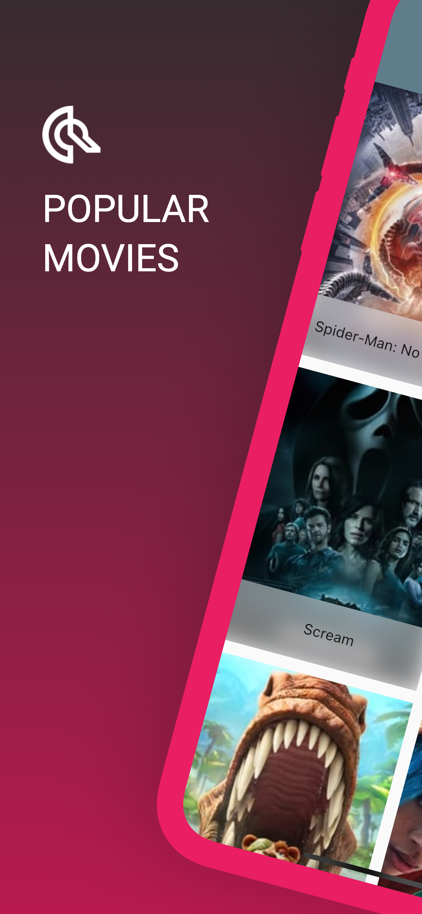
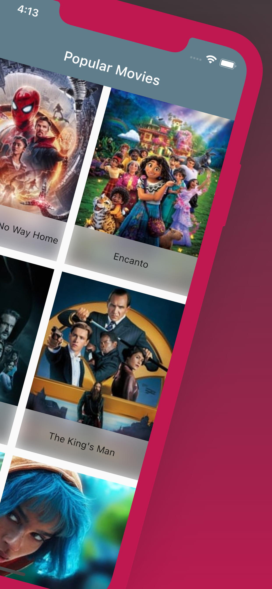

If my code is helpful to you, I really appreceiate if you buy me a coffee 🙇🏻‍☕️ 

# Q Movies

Sample Flutter movies project that aim to how to combine and integrate Riverpod, Networking (movies api call), Refresh Indicator 

|  |  |
|-|-|

## All in one
    - REST API
    - Networking(Dio)
    - Business Logic (Riverpod)
    - Reflesh Indicator

### Getting Started
- Register your own API key on https://www.themoviedb.org  

- Open .vscode > launch.json > paste your own api key

